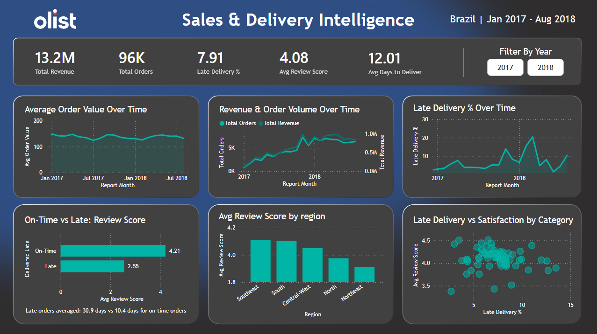
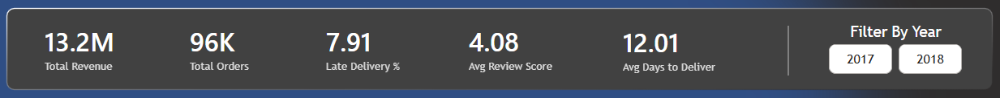
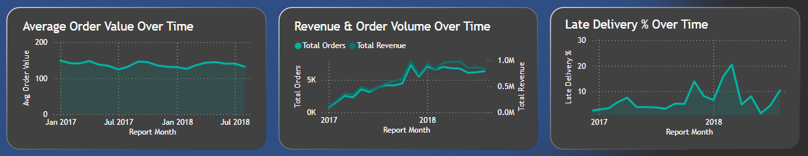
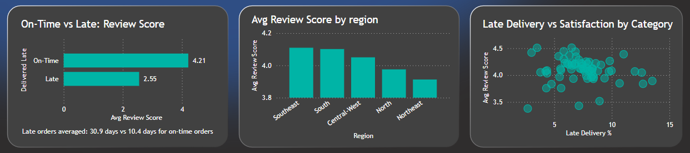
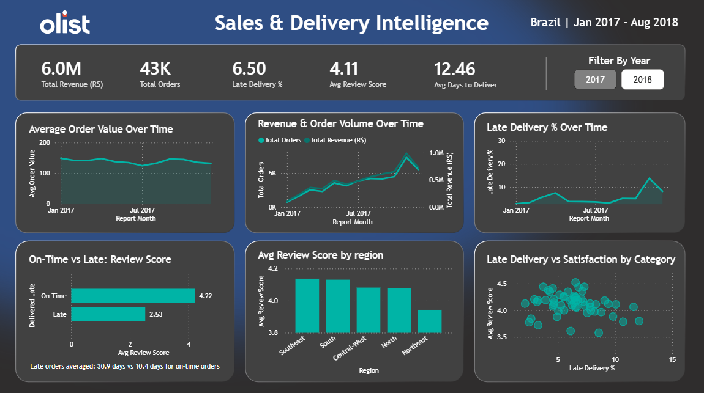

# 🚀 Brazilian E-Commerce End-to-End Data Analytics Project

## Contents

- [Business Scenario](#-business-scenario)
- [Dashboard](#-dashboard)
- [Key Findings](#-key-findings)
- [Recommendations](#-recommendations)
- [Data Visualisation](#-data-visualisation)
- [Dataset](#-dataset)
- [Tools Used](#️-tools-used)
- [Key KPIs Analysed](#-key-kpis-analysed)
- [Data Architecture](#️-data-architecture)
- [About Me](#-about-me)

---

## 🎭 Business Scenario

It's mid 2018, and I'm working as a Data Analyst for Olist, a Brazilian e-commerce marketplace. The executive leadership team has requested a clear picture of how the business has performed over the previous two years, with a particular focus on revenue growth, regional performance and customer satisfaction.

To support this, I needed to answer several key business questions.

**The main question:**

- How can Olist improve sustainable growth while maintaining customer satisfaction across regions and product categories?

**Supporting questions:**

- Is revenue growth being driven by increasing order volume or higher-value purchases?
- How does delivery performance impact customer satisfaction?
- Which regions experience the worst delivery performance, and how does it affect satisfaction?
- Which product categories create the greatest operational or customer satisfaction risks?

The challenge was that the data was fragmented across 9 CSV files and contained inconsistencies, missing values and Portuguese product category names.

My goal was to design and build an end-to-end analytics pipeline that transformed this raw operational data into a structured reporting layer capable of supporting executive decision-making.

---

## 📸 Dashboard



---

## 🔍 Key Findings

> **Note:** Figures below reflect the corrected star schema data. The original view-based gold layer was overstating total revenue by ~15% (R$15.4M) due to row duplication from view joins. The star schema rebuild corrected this to R$13.2M.

- **Revenue growth is volume-driven**

Orders grew from 750/month in January 2017 to 6,000-7,000+/month by late 2017 and through 2018, with a peak of 7,289 orders in November 2017, likely driven by Black Friday. Total revenue across the period was R$13.2M across 96K orders. Average order value stayed flat at ~R$146-170 throughout. Olist is bringing in more customers but spend per customer isn't increasing.

- **Late delivery is the biggest driver of low satisfaction**

On-time orders average a review score of 4.21. Late orders average 2.55 — a 1.66 point drop on a 1-5 scale. Late orders also take 3x longer to arrive (30.9 days vs 10.4).

- **The Northeast is the highest-risk region**

The North is slow (22.2 avg days) but predictable — customers seem to accept the wait. The Northeast is the bigger problem: 14.1% late rate (highest of any region), 3.91 avg score (lowest), and Olist is regularly missing its own delivery estimates. Worst states: AL (24.1% late), MA (3.76 avg score), CE (15.3% late, 1,280 orders affected).

- **Bed, Bath & Table and Office Furniture are the highest-risk categories**

Bed, Bath & Table has the most late deliveries by volume (811) and a 3.93 score. Office Furniture scores 3.52, the lowest of any category with 1,000+ orders, despite only an 8.9% late rate, suggesting damage in transit for heavy items.

---

## 💡 Recommendations

**1. Fix delivery reliability in the Northeast**

The Northeast has a 14.1% late rate — nearly double the Southeast. Alagoas (AL), Maranhão (MA) and Ceará (CE) are the worst states. Improving logistics partnerships or setting more realistic delivery estimates for this region would have the biggest impact on customer satisfaction.

**2. Review fulfilment for the Bed, Bath & Table category**

811 late deliveries and a 3.93 score make this the highest-risk category by volume. It's worth looking at whether sellers in this category are consistently missing shipping windows and whether tighter SLAs would help.

**3. Investigate packaging for Office Furniture**

Office Furniture scores 3.52, the lowest of any major category, despite only an 8.9% late rate. The issue isn't delivery speed, it's likely damage in transit. Better packaging requirements for heavy and bulky items could improve scores here without changing logistics at all.

**4. Look at ways to grow average order value**

Revenue growth has been entirely volume-driven since 2016; average order value has stayed flat at ~R$146-170 throughout. Bundles, cross-sell recommendations or free shipping thresholds could help increase what customers spend per order.

---

## 📊 Data Visualisation

I created a single page dashboard in Power BI to present my findings. A Year slicer in the top right filters all visuals at once, and clicking any chart cross-filters the rest of the page.

Below is a walkthrough of each row:

**Top row — KPI cards**



Five headline numbers across the top: total revenue (R$13.2M), total orders (96K), late delivery rate, average review score and average delivery days. These give a quick snapshot of the business before looking at the detail below.

**Middle row — Revenue and growth**



- _Average Order Value Over Time_ — a flat line throughout the period, which confirms growth isn't coming from bigger baskets
- _Revenue & Order Volume Over Time_ — revenue and order count plotted together, both climbing steadily from early 2017 to 2018, driven by volume
- _Late Delivery % Over Time_ — shows how the late delivery rate trended month by month, useful for spotting whether the problem is getting better or worse over time

**Bottom row — Delivery and satisfaction**



- _On-Time vs Late: Review Score_ — the clearest chart on the page. Two bars: 4.21 for on-time deliveries, 2.55 for late deliveries. The subtitle also shows the delivery time gap (30.9 days vs 10.4)
- _Avg Review Score by Region_ — satisfaction broken down by Brazil's five regions, with the Northeast visibly below the rest
- _Late Delivery vs Satisfaction by Category_ — a scatter plot where each dot is a product category, plotted by late delivery rate and average review score. Categories sitting bottom-right are the highest risk

The Year slicer lets you compare 2017 and 2018 side by side. Here's an example with 2017 selected:



---

## 📊 Dataset

This project uses the [Brazilian E-Commerce Public Dataset by Olist](https://www.kaggle.com/datasets/olistbr/brazilian-ecommerce), sourced from Kaggle.

The dataset contains 1.5 million rows across 9 tables covering real commercial transactions between 2016 and 2018, including orders, customers, products, sellers, payments, reviews and geolocation data.

---

## 🛠️ Tools Used

| Tool       | Purpose                                                                        |
| ---------- | ------------------------------------------------------------------------------ |
| PostgreSQL | Data cleaning, transformation, modelling and analysis                          |
| SQL        | Layered pipeline from raw ingestion through to business-ready analytical views |
| Power BI   | Interactive dashboard development and business visualisation                   |
| GitHub     | Project documentation and version control                                      |

---

## 📈 Key KPIs Analysed

### Revenue & Growth

- Total Revenue (R$13.2M across delivered orders)
- Average Order Value (AOV) — flat at ~R$146-170 throughout
- Order Volume Growth — grew from ~100/month in late 2016 to 6,000+/month by mid-2018
- Monthly Revenue Growth % — tracked over time to identify trends

### Customer Experience

- Average Review Score (4.08 overall)
- Average Delivery Time (12.01 days)
- Late Delivery Rate (7.91% overall)
- On-Time vs Late Review Score comparison (4.21 vs 2.55)

### Commercial Performance

- Regional Delivery & Satisfaction Performance
- Product Category Risk Analysis (late delivery rate vs satisfaction score)

---

## 🏗️ Data Architecture

I structured this project using a layered analytics approach, moving from raw source data into cleaned staging models and finally into business-ready reporting tables.

The goal was to keep the raw data untouched, clean and standardise it in staging, and then build reliable analytical models for reporting in Power BI.

### Raw Layer (`raw/`)

The raw layer contains the original CSV data loaded directly into PostgreSQL with no transformations applied. All date columns are stored as VARCHAR, coordinates are stored as VARCHAR, and city name misspellings are preserved exactly as they appear in the source files.

The nine raw tables are:

- `raw.customers` — customer ID, unique customer ID, zip code prefix, city, state
- `raw.orders` — order ID, customer ID, status, and five date columns (all stored as VARCHAR)
- `raw.order_items` — order ID, product ID, seller ID, price, freight value
- `raw.order_payments` — order ID, payment sequential, payment type, instalments, payment value
- `raw.order_reviews` — review ID, order ID, review score, comment title, comment message, two timestamps
- `raw.products` — product ID, category name in Portuguese, physical dimensions and weight
- `raw.product_category_name_translation` — Portuguese to English category name mapping
- `raw.sellers` — seller ID, zip code prefix, city, state
- `raw.geolocation` — zip code prefix, latitude, longitude, city, state (over 1M rows)

Before building any transformations, I profiled each table to assess data quality. The goal was to understand what problems existed in the raw data before writing any cleaning logic.

Key issues found during profiling:

- Over 1M geolocation rows with heavily duplicated zip code mappings (up to 50 rows per zip code)
- Seller city names with widespread formatting inconsistencies, typos, double spaces and invalid entries including email addresses
- Geolocation coordinates outside Brazil's geographic boundaries
- Products missing category names and associated metadata
- Orders marked as delivered but with no actual delivery date recorded
- Orders with multiple payment records, creating a one-to-many join risk
- Around 8% of orders arriving after the estimated delivery date

These findings shaped the cleaning logic built in the staging layer.

_**Example logic: Profiling checks**_

```sql
-- Validate customer_id uniqueness
SELECT
    customer_id,
    COUNT(*) AS frequency
FROM raw.customers
GROUP BY 1
HAVING COUNT(*) > 1;

-- Identify inconsistent seller city names
SELECT
    seller_city,
    COUNT(*) AS frequency
FROM raw.sellers
GROUP BY 1
ORDER BY 1 ASC;
```

---

### Cleaning Layer (`staging/`)

The staging layer contains eight cleaned and standardised views built directly on top of the raw tables. No data is removed from raw; all transformations happen within the view definitions.

Here is what each view does:

- `stg_orders` — casts all five date columns from VARCHAR to TIMESTAMP; derives `is_late_delivery` (1 if the actual delivery date is after the estimated date) and `is_completed_order` (1 if order status is delivered)
- `stg_customers` — lowercases and trims city names; uppercases and trims state codes
- `stg_order_items` — rounds price and freight to two decimal places; adds `total_item_value` as price plus freight
- `stg_order_payments` — standardises payment type labels (boleto becomes bank_transfer, not_defined becomes unknown)
- `stg_order_reviews` — casts review timestamps from VARCHAR to TIMESTAMP; replaces NULL comment titles and messages with placeholder text
- `stg_products` — joins the product category translation table to map Portuguese names to English; manually maps four edge cases not covered by the translation table; defaults NULL categories to unknown; renames misspelled source columns
- `stg_sellers` — uses a CTE to lowercase, trim and collapse double spaces with regex, then strips state code suffixes before applying 20+ CASE conditions to normalise city name variations; flags invalid entries such as numeric strings, email addresses and very short values as unknown
- `stg_geolocation` — deduplicates the 1M+ row table by grouping on zip code and averaging lat and lng coordinates; applies a bounding box filter to exclude any coordinates outside Brazil's geographic boundaries

_**Example logic: Deriving the `is_late_delivery` flag in `stg_orders`**_

```sql
SELECT
    order_id,
    order_estimated_delivery_date,
    order_delivered_customer_date,
    CASE
        WHEN order_delivered_customer_date > order_estimated_delivery_date THEN 1
        ELSE 0
    END AS is_late_delivery
FROM staging.stg_orders;
```

---

### Analytics Layer (`gold/`)

The analytics layer contains the final business-ready models used for reporting and dashboarding.

The gold layer was initially built as a set of SQL views. While this worked for early analysis, it caused two problems when connecting to Power BI: without surrogate keys, table relationships couldn't be properly defined, and the view-based join approach was producing duplicate rows. This was discovered when the original dashboard was found to be overstating total revenue by around 15% — showing R$15.4M instead of the correct R$13.2M. The layer was fully rebuilt as a proper star schema with materialised tables to fix this.

**Fact table**

- `fact_order_items` — one row per order line item. Contains foreign keys to all dimension tables plus the core metrics: price, freight value, total item value, and delivery flags.

**Dimension tables**

- `dim_customer` — one row per customer, with surrogate key
- `dim_product` — one row per product, with surrogate key and English category name
- `dim_seller` — one row per seller, with surrogate key and normalised city name
- `dim_order` — one row per order, with surrogate key and all order-level dates and status flags
- `dim_date` — date spine with year, month and quarter attributes for time intelligence in Power BI

Each dimension has a surrogate key generated with `ROW_NUMBER()` so Power BI can define proper relationships between tables.

These models support analysis across:

- Revenue and order volume trends
- Delivery performance and reliability
- Regional satisfaction and late delivery rates
- Product category risk

_**Example logic: Building dim_date**_

```sql
INSERT INTO gold.dim_date (date_id, full_date, year, month, month_name, quarter)
SELECT
    ROW_NUMBER() OVER (ORDER BY d::DATE) AS date_id,
    d::DATE AS full_date,
    DATE_PART('year', d)::INT AS year,
    DATE_PART('month', d)::INT AS month,
    TO_CHAR(d, 'Month') AS month_name,
    DATE_PART('quarter', d)::INT AS quarter
FROM GENERATE_SERIES('2016-01-01', '2018-12-31', INTERVAL '1 day') AS d;
```

---

<div align="center">

## 👨🏼‍💻 About Me

**Steven Jackson** — MSc in Software Development — Queen's University Belfast

If you'd like to connect or have any questions/suggestions about the project, feel free to reach out 👇🏻

[](https://www.linkedin.com/in/steven-jackson-62b795193/)

</div>
