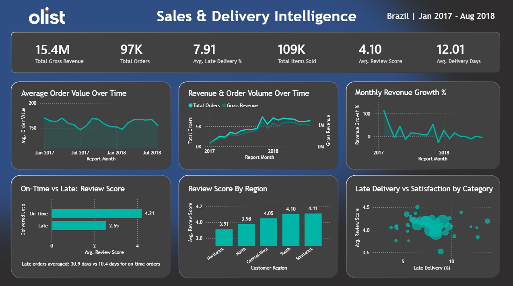

# 🚀 Brazilian E-Commerce End-to-End Data Analytics Project

## 🎭 Business Scenario

It's late 2018, and I'm working as a Data Analyst for Olist, a Brazilian e-commerce marketplace. The executive leadership team has requested a clear picture of how the business has performed over the previous two years, with a particular focus on revenue growth, regional performance and customer satisfaction.

To support this, I needed to answer several key business questions.

**The main question:**

- How can Olist improve sustainable growth while maintaining customer satisfaction across regions and product categories?

**Supporting questions:**

- Is revenue growth being driven by increasing order volume or higher-value purchases?
- How does delivery performance impact customer satisfaction?
- Which regions experience the worst delivery performance, and how does it affect satisfaction?
- Which product categories create the greatest operational or customer satisfaction risks?

The challenge was that the data was fragmented across 9 CSV files and contained inconsistencies, missing values and Portuguese product category names.

My goal was to design and build an end-to-end analytics pipeline that transformed this raw operational data into a structured reporting layer capable of supporting executive decision-making.

---

## 📸 Dashboard



---

## 📊 Dataset

This project uses the [Brazilian E-Commerce Public Dataset by Olist](https://www.kaggle.com/datasets/olistbr/brazilian-ecommerce), sourced from Kaggle.

The dataset contains 1.5 million rows across 9 tables covering real commercial transactions between 2016 and 2018, including orders, customers, products, sellers, payments, reviews and geolocation data.

---

## 🛠️ Tools Used

| Tool       | Purpose                                                                        |
| ---------- | ------------------------------------------------------------------------------ |
| PostgreSQL | Data cleaning, transformation, modelling and analysis                          |
| SQL        | Layered pipeline from raw ingestion through to business-ready analytical views |
| Power BI   | Interactive dashboard development and business visualisation                   |
| GitHub     | Project documentation and version control                                      |

---

## 🏗️ Data Architecture

I structured this project using a layered analytics approach, moving from raw source data into cleaned staging models and finally into business-ready reporting tables.

The goal was to keep the raw data untouched, clean and standardise it in staging, and then build reliable analytical models for reporting in Power BI.

### Raw Layer (`raw/`)

The raw layer contains the original CSV data loaded directly into the database with no transformations applied.

I mainly used this layer for profiling and data quality checks before building any transformations. I wanted to understand how reliable the data was, spot inconsistencies early, and avoid issues later when calculating KPIs.

During a full exploratory data quality assessment, I checked for:

- Duplicate primary keys
- Missing values in important columns
- Invalid dates and delivery records
- Geography spelling inconsistencies
- Pricing and payment outliers
- One-to-many joins that could inflate metrics

Key profiling issues I found included:

- Over 1M geolocation rows with lots of duplicate ZIP mappings
- Seller city names entered in many different formats
- Coordinates outside Brazil that needed filtering
- Products missing category and metadata information
- Orders marked as delivered but missing delivery dates
- Orders using multiple payment records
- Around 8% of deliveries arriving late

These findings helped shape the cleaning logic I later built in the staging layer.

_**Example logic: Profiling checks**_

```sql
-- Validate customer_id uniqueness
SELECT
    customer_id,
    COUNT(*) AS frequency
FROM raw.customers
GROUP BY 1
HAVING COUNT(*) > 1;

-- Identify inconsistent seller city names
SELECT
    seller_city,
    COUNT(*) AS frequency
FROM raw.sellers
GROUP BY 1
ORDER BY 1 ASC;
```

---

### Cleaning Layer (`staging/`)

The staging layer contains cleaned and standardised views built to prepare the source data for reliable analysis.

This is where I handled most of the transformation work needed to make the data reliable for analysis.

Some of the cleaning and transformation steps included:

- Standardising city and state names
- Removing invalid geographic records
- Deduplicating geolocation data
- Translating Portuguese product categories
- Validating timestamps
- Filtering anomalous future dates
- Aggregating payment rows before joins
- Creating delivery performance flags

I also used this layer to fix structural issues I found during profiling, especially around geography inconsistencies and duplicated payment behaviour.

_**Example logic: Adding the `is_late_delivery` flag**_

```sql
SELECT
    order_id,
    order_estimated_delivery_date,
    order_delivered_customer_date,
    CASE
        WHEN order_delivered_customer_date > order_estimated_delivery_date THEN 1
        ELSE 0
    END AS is_late_delivery
FROM staging.stg_orders;
```

---

### Analytics Layer (`gold/`)

The analytics/marts layer contains the final business-ready models used for reporting and dashboarding.

Here, I consolidated transactional, customer, payment, delivery, and review data into denormalised analytical views that could support KPI tracking and business analysis in Power BI.

Main analytical models:

- `fact_sales`
- `monthly_revenue`
- `revenue_growth`
- `delivery_performance`
- `customer_segments`
- `category_risk`

These models support analysis across:

- Revenue and order volume trends
- Delivery performance and reliability
- Regional satisfaction and late delivery rates
- Product category risk

_**Example logic: Building the category risk view**_

```sql
WITH deduped_reviews AS (
    SELECT
        order_id,
        MAX(review_score) AS review_score
    FROM staging.stg_order_reviews
    GROUP BY order_id
)
SELECT
    f.category_name_english,
    COUNT(DISTINCT f.order_id) AS total_orders,
    ROUND(CAST(SUM(f.is_late_delivery) AS NUMERIC) / COUNT(*) * 100, 1) AS late_delivery_pct,
    SUM(f.is_late_delivery) AS late_orders,
    ROUND(CAST(AVG(r.review_score) AS NUMERIC), 2) AS avg_review_score
FROM gold.fact_sales f
LEFT JOIN deduped_reviews r ON f.order_id = r.order_id
GROUP BY 1
ORDER BY late_orders DESC;
```

---

## 📈 Key KPIs Analysed

### Revenue & Growth

- Total Revenue
- Average Order Value (AOV)
- Monthly Revenue Growth

### Customer Experience

- Customer Review Score
- Average Delivery Time
- Late Delivery Rate

### Commercial Performance

- Regional Sales Performance
- Product Category Performance

---

## 🔍 Key Findings

- **Revenue growth is volume-driven**

Orders grew from ~100/month in late 2016 to 6,000+/month by late 2018. Average order value stayed flat at ~R$130-160 throughout. Olist is bringing in more customers but spend per customer isn't increasing.

- **Late delivery is the biggest driver of low satisfaction**

On-time orders average a review score of 4.21. Late orders average 2.55 - a 1.66 point drop on a 1-5 scale. Late orders also take 3x longer to arrive (30.9 days vs 10.4).

- **The Northeast is the highest-risk region**

The North is slow (22.2 avg days) but predictable — customers seem to accept the wait. The Northeast is the bigger problem: 14.2% late rate (highest of any region), 3.91 avg score (lowest), and Olist is regularly missing its own delivery estimates. Worst states: AL (24.1% late), MA (3.76 avg score), CE (1,426 orders affected).

- **Bed, Bath & Table and Office Furniture are the highest-risk categories**

Bed, Bath & Table has the most late deliveries by volume (920) and a 3.93 score. Office Furniture scores 3.52, the lowest of any category with 1,000+ orders, despite only an 8.9% late rate, suggesting damage in transit for heavy items.

---

## 📊 Data Visualisation

I created a single page dashboard, split into two rows of charts, in Power BI to present my findings.

Below is a walkthrough of each row:

**Top row — KPI cards**


Six headline numbers across the top: total revenue, total orders, late delivery rate, total items sold, average review score and average delivery days. These give a quick snapshot of the business before looking at the detail below.

**Middle row — Revenue and growth**


- _Average Order Value Over Time_ — a flat line throughout the period, which confirms growth isn't coming from bigger baskets
- _Revenue & Order Volume Over Time_ — revenue and order count plotted together, both climbing steadily from early 2017 to 2018, driven by volume
- _Monthly Revenue Growth %_ — shows the month-on-month growth rate. Big swings early on when order numbers were still small

**Bottom row — Delivery and satisfaction**


- _On-Time vs Late: Review Score_ — the clearest chart on the page. Two bars: 4.21 for on-time deliveries, 2.55 for late deliveries. The gap makes the correlation between punctual deliveries and better review scores immediately obvious
- _Review Score by Region_ — satisfaction broken down by Brazil's five regions, with the Northeast visibly below the rest
- _Late Delivery vs Satisfaction by Category_ — a scatter plot where each dot is a product category, plotted by late delivery rate and average review score. Categories sitting bottom-right (high late rate, low score) are the ones that need attention most

---

## 💡 Recommendations

**1. Fix delivery reliability in the Northeast**

The Northeast has a 14.2% late rate — nearly double the Southeast. Alagoas (AL), Maranhão (MA) and Ceará (CE) are the worst states. Improving logistics partnerships or setting more realistic delivery estimates for this region would have the biggest impact on customer satisfaction.

**2. Review fulfilment for the Bed, Bath & Table category**

920 late deliveries and a 3.93 score make this the highest-risk category by volume. It's worth looking at whether sellers in this category are consistently missing shipping windows and whether tighter SLAs would help.

**3. Investigate packaging for Office Furniture**

Office Furniture scores 3.52, the lowest of any major category, despite only an 8.9% late rate. The issue isn't delivery speed, it's likely damage in transit. Better packaging requirements for heavy and bulky items could improve scores here without changing logistics at all.

**4. Look at ways to grow average order value**
Revenue growth has been entirely volume-driven since 2016; average order value has stayed flat at ~R$130-160 throughout. Bundles, cross-sell recommendations or free shipping thresholds could help increase what customers spend per order.
